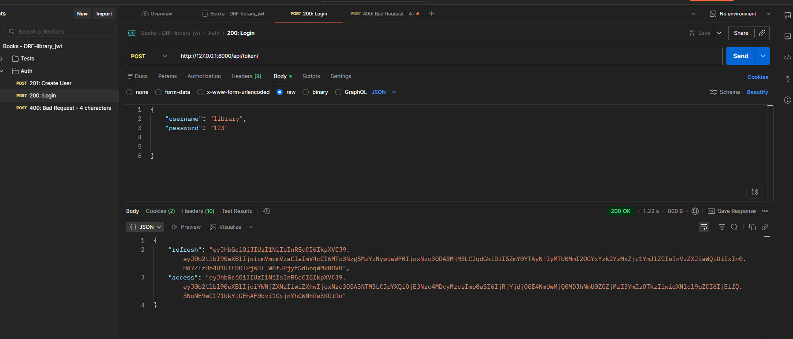
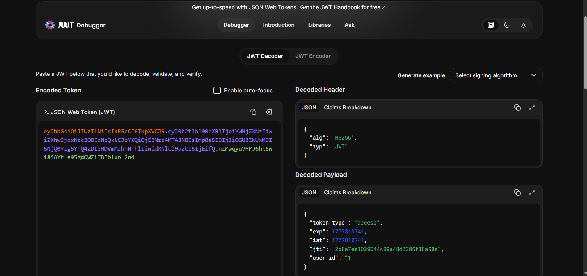

# Library API + JWT

A REST API for a library, with JWT authentication. Built on Django + DRF
+ SimpleJWT. Users register, get an access/refresh token pair, and
manage a catalog of authors and books.

## Features

- JWT authentication via `djangorestframework-simplejwt`
  (access + refresh tokens)
- User registration through a dedicated endpoint
- Full CRUD for authors and books via DRF `ModelViewSet`
- Public `GET` for catalog browsing — write access only for authenticated
  users (`IsAuthenticatedOrReadOnly`)
- `created_by` field auto-assigned to the current user when a book is
  created
- `/api/me/` endpoint to fetch info about the current user
- Django admin panel for the `Author` and `Book` models
- Config via `.env` (`python-decouple`), PostgreSQL as the database
- Seed data in `backup.json` for a quick start

## Tech Stack

- Python 3.11+
- Django 6.0
- Django REST Framework 3.17
- djangorestframework-simplejwt 5.5
- PostgreSQL (psycopg2-binary)
- python-decouple (env config)

## Installation

```bash
git clone https://github.com/example.git
cd library_jwt

python -m venv venv
venv\Scripts\activate          # Windows
# source venv/bin/activate     # Linux / macOS

pip install -r requirements.txt

cp .env.example .env
# fill in SECRET_KEY and database credentials

python manage.py migrate
python manage.py createsuperuser
python manage.py runserver
```

## Running with Docker

The project ships with a `Dockerfile` and `docker-compose.yml` that spin up
the Django app together with a PostgreSQL 15 container. Make sure `.env`
exists (see `.env.example`) and that `DB_HOST=db` so the app can reach the
database service.

```bash
docker-compose up --build
```

In a second terminal, run the initial setup inside the `web` container:

```bash
docker-compose exec web python manage.py migrate
docker-compose exec web python manage.py createsuperuser
docker-compose exec web python manage.py loaddata backup.json
```

The API will be available at http://127.0.0.1:8000/api/.

## Project Structure

```
config/         Django project settings (settings, urls)
books/          Main app (Author/Book models, views, serializers)
backup.json     Seed-data dump (fixtures)
screenshots/    Screenshots used in the README
```

The API is available at http://127.0.0.1:8000/api/

## Environment Variables

Configured via `.env` (not committed). See `.env.example` for the
template.

| Variable | Description |
|---|---|
| `SECRET_KEY` | Django secret key. Generate a new one for production. |
| `DEBUG` | `True` for development, `False` for production. |
| `ALLOWED_HOSTS` | JSON array of allowed hostnames, e.g. `["127.0.0.1","localhost"]`. |
| `DB_NAME` | PostgreSQL database name. |
| `DB_USER` | Database user. |
| `DB_PASSWORD` | Database password. |
| `DB_HOST` | Database host (usually `localhost`). |
| `DB_PORT` | Database port (default `5432`). |

## Auth Endpoints

- `POST /api/register/` — register a new user
- `POST /api/token/` — log in (get access + refresh pair)
- `POST /api/token/refresh/` — refresh the access token
- `GET  /api/me/` — info about the current user (requires JWT)

## CRUD Endpoints

- `GET/POST       /api/authors/`
- `GET/PUT/DELETE /api/authors/{id}/`
- `GET/POST       /api/books/`
- `GET/PUT/DELETE /api/books/{id}/`

`GET` is public for everyone. All other methods require a JWT in the
header:

```
Authorization: Bearer <access_token>
```

## Seed Data (backup.json)

The repo ships with `backup.json` at the project root — a Django
`dumpdata` export containing sample authors, books, and users. To load
it into a fresh database after running `migrate`:

```bash
python manage.py loaddata backup.json
```

To produce your own dump from the current database:

```bash
python manage.py dumpdata --indent 2 > backup.json
```

> The file contains password hashes for sample users — do not use this
> dump in production.

## Screenshots

Full test pass through the API — one screenshot per case, in order.

| # | Test case | Preview                                                                        |
|---|---|--------------------------------------------------------------------------------|
| 1 | `POST /api/register/` — user created, returns 201, password is NOT included in the response |  |
| 2 | `POST /api/register/` with a too-short password (4 chars) — 400 Bad Request |  |
| 3 | `POST /api/token/` with valid username + password — returns `{access, refresh}` |  |
| 4 | `POST /api/token/` with wrong password — 401 |  |
| 5 | `POST /api/token/refresh/` with a valid refresh — returns a new access token |  |
| 6 | `GET /api/me/` WITH a token — 200, returns info about the logged-in user |  |
| 7 | `GET /api/authors/` WITHOUT a token — 200 OK (read-only allowed for guests) |  |
| 8 | `POST /api/authors/` WITHOUT a token — 401 Unauthorized |  |
| 9 | `POST /api/authors/` WITH a token (`Authorization: Bearer ...`) — 201 Created |  |
| 10 | `GET /api/books/` WITHOUT a token — 200, returns the list with `author_name` |  |
| 11 | `POST /api/books/` WITH a token — 201 Created |  |
| 12 | `PUT /api/books/1/` WITH a token — 200 (full replace) |  |
| 13 | `PATCH /api/books/1/` WITH a token — 200 (partial update) |  |
| 14 | `DELETE /api/books/1/` WITH a token — 204 No Content |  |
| 15 | `DELETE /api/books/1/` WITHOUT a token — 401 |  |
| — | jwt.io (decoded token) |                                               |

## Author

**Nazar Humen**
GitHub: [@NazarHumen](https://github.com/NazarHumen)
Email: nazargumen11@gmail.com

Built as a portfolio project for a Django REST Framework course.
